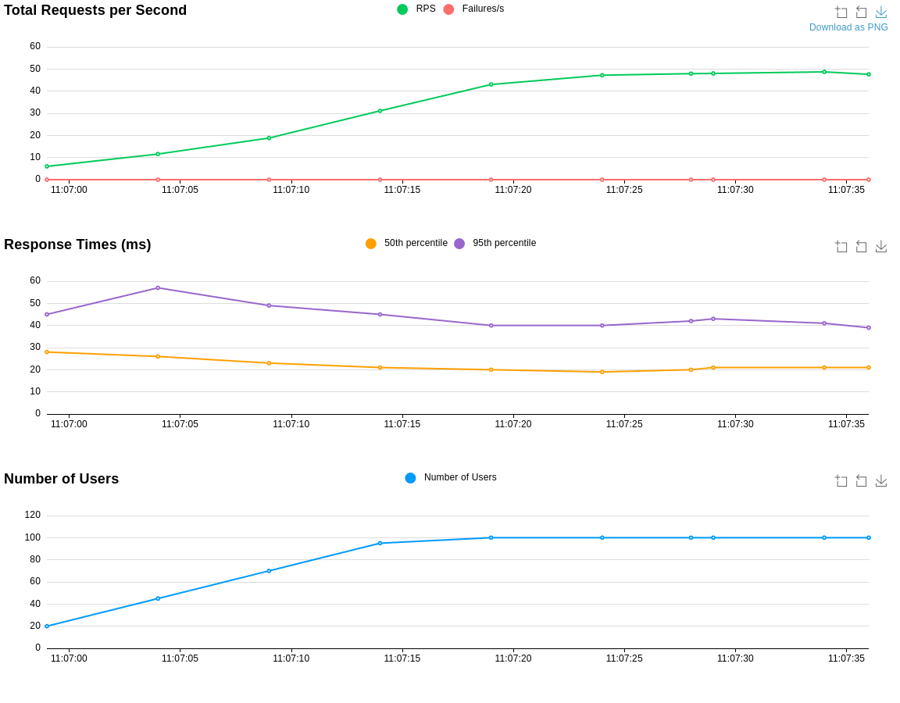

# ml_bench_demo
a small demo for benchmarking some ml frameworks  used in a webserver inference (with rust) and yolov8 <br>
this project depends on 

- tract
- tch-rs
- ort

currently  only tested on linux systems, for CPU inference only, though i might add GPU inference and other frameworks later. <br>


# installing dependencies
you need to link C++ libraries libonnxruntime and libtorch, so download them and then add it to your LD_LIBRARY_PATH (on linux) <br>
you can find libonnxruntime [here](https://github.com/microsoft/onnxruntime/releases) we use version 1.18.1, <br>
and libtorch [here](https://pytorch.org/) we use version 2.4.0


```
export LD_LIBRARY_PATH=/path/to/libonnxruntime/lib${LD_LIBRARY_PATH:+:${LD_LIBRARY_PATH}}
export LIBTORCH=/path/to/libtorch
export LD_LIBRARY_PATH=${LIBTORCH}/lib:$LD_LIBRARY_PATH
```
refresh your shell by running `source ~/.bashrc`, `source ~/.zshrc` or `exec $SHELL`


# building the project

the webserver demo
```bash
cargo build --bin demo_webserver --release
```

the local demo
```bash
cargo build --bin local --release
```

# using the project as a library 
currently it's possible , but i havent documented it (Yet) 


# Performance 
## 1 Worker 

### ort (libonnxruntime)


### tch-rs (libtorch)


### tract


## 4 Worker 

### ort (libonnxruntime)


### tch-rs (libtorch)


### tract


## 16 Worker 

### ort (libonnxruntime)


### tch-rs (libtorch)


### tract


